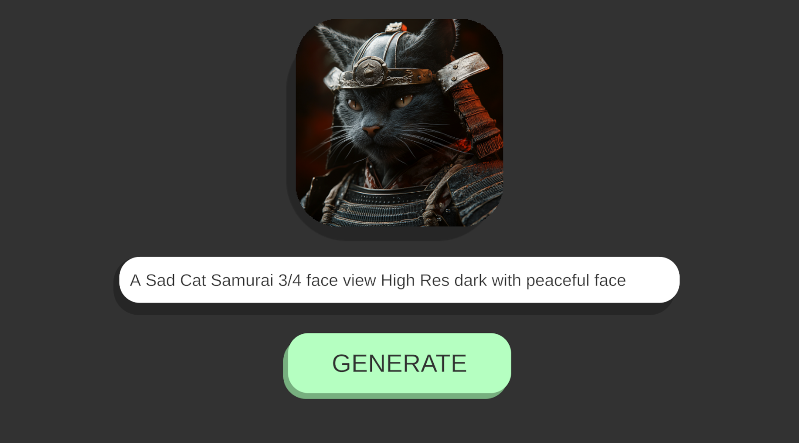

# Midjoureny-API-For-Unity
 - Generating images in unity using midjoureny through [userapi.ai](https://userapi.ai)

## UI
 

## Implementation
 - Make an account in [userapi.ai](https://userapi.ai)
 - Follow [THIS](https://medium.com/@divan.brexov/how-to-get-all-midjourney-functional-via-api-7ece4ab0660f) Blog to setup & connect to your MidJourney API.
 - Setup a Webhook to expose endpoints - I prefer [Webhook.site](https://webhook.site/) (Easy) and assign webhook variable in below code.
 - Enter all the Kyes and URL from userapi.ai [Dashboard](https://dashboard.userapi.ai/discord-accounts) in the code provided below in this repo.
 - All the base code is provided in the [CODE](https://github.com/00siddhant00/Midjoureny-API-For-Unity/blob/main/Assets/Scripts/MidjourneyAPIs.cs)
   - Callbacks Used:
     - POST
     - GET 
 - Check out the doc for ferther implimentations - [Read Doc](https://butternut-saffron-e5e.notion.site/Midjourney-userapi-ai-doc-en-119680339b0a47e2ba6ae467eca58142#03f78e40cb094001b7b1c6f4aae0af4c).
 - Enjoy 😌!
